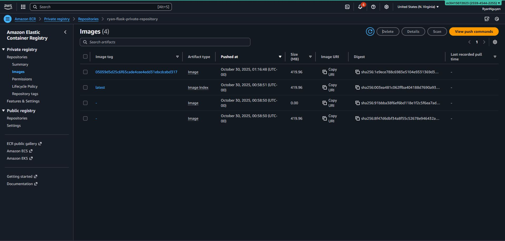
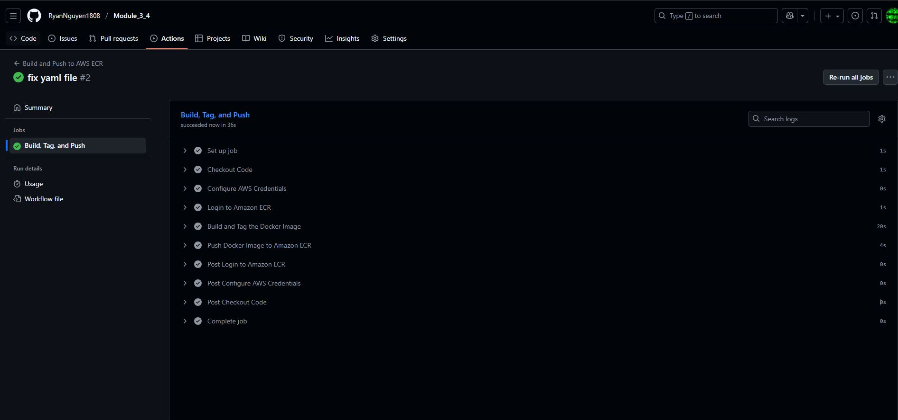

Module 3.4 ECS Part 1

1. Docker image will be built base on the commit number.

2. CICD will be skipt if commit message contains string [skip cicd]

3. ECR after image built and push from github actions

4. Github Actions Details
